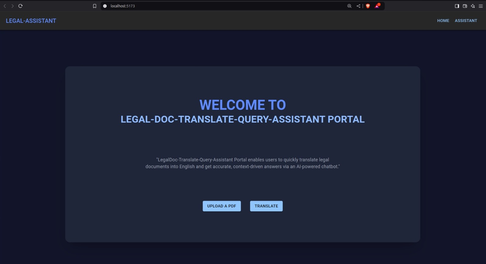
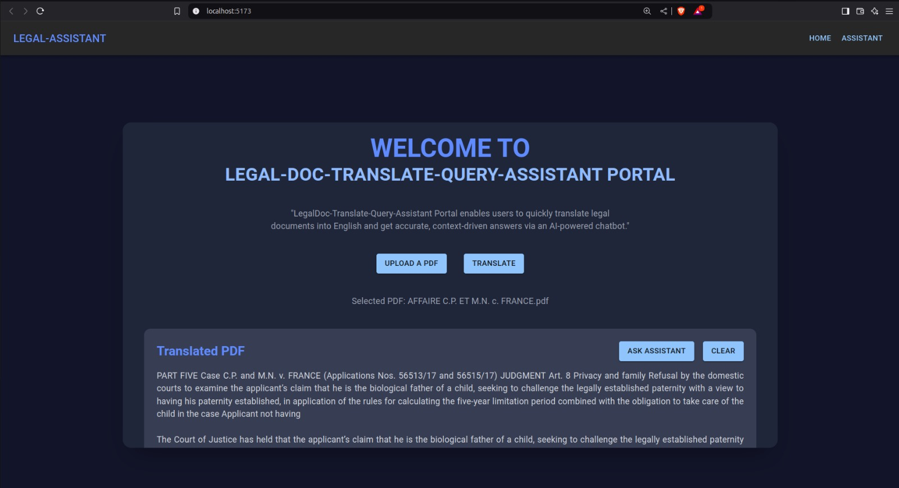
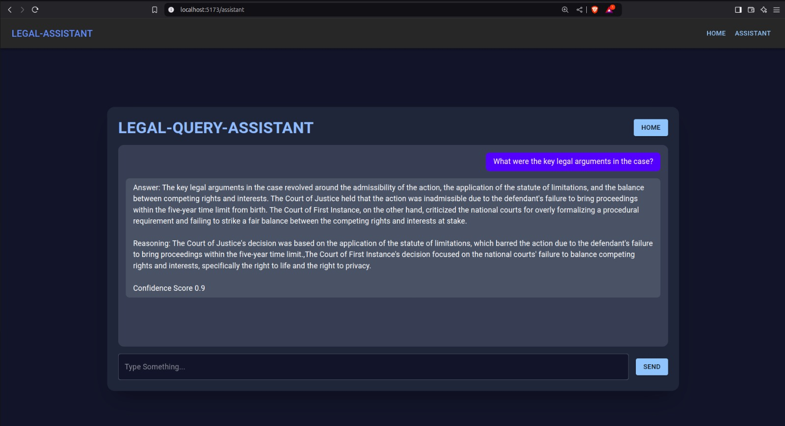
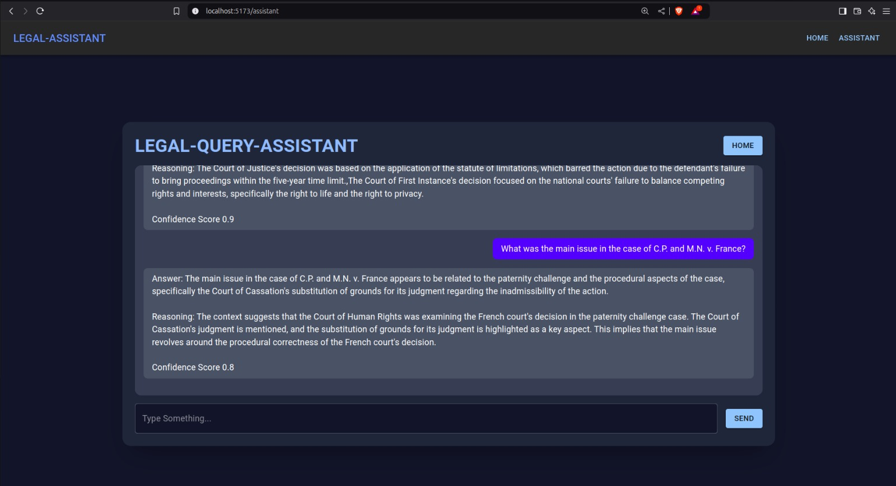
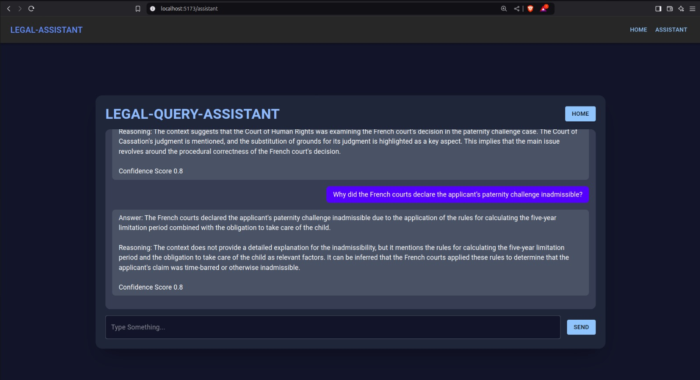

# LegalDoc-Translate-Query-Assistant

## Overview

**LegalDoc-Translate-Query-Assistant** is a powerful AI-driven legal document processing tool designed to:

- Translate legal case PDFs in any language to English.
- Store translated content as embeddings in Pinecone.
- Provide a **RAG-based LLM assistant** to answer legal queries using Groq's LLM.

The application consists of:
- **Backend**: A FastAPI server that handles translation, embedding storage, and query processing.
- **Frontend**: A React.js web app built with TypeScript and Material UI for seamless interaction.

---

## Features

**PDF Translation** - Convert any legal case document into English.
**Vector Search with Pinecone** - Efficient retrieval of relevant legal information.
**RAG-based LLM Assistant** - Provides evidence-based legal answers.
**FastAPI Backend** - Scalable and efficient API services.
**Frontend UI** - Built with React.js and Material UI for a smooth user experience.

---

## Technologies Used

| Component  | Technologies Used |
|------------|------------------|
| Backend    | FastAPI, PyTorch, MBart, Pinecone, SentenceTransformers, Groq LLM |
| Frontend   | React.js, TypeScript, Material UI |
| Database   | Pinecone Vector DB |

---

## Project Structure

```
LegalDoc-Translate-Query-Assistant
│── backend
│   ├── app.py                  # FastAPI server
│   ├── rag_pipeline.py          # Retrieval-Augmented-Generation pipeline
│
│── frontend
│   ├── src
│   │   ├── components           # UI Components
│   │   ├── pages
│   │   │   ├── Home.tsx         # PDF Translation Page
│   │   │   ├── Assistant.tsx    # Query Assistant Page
│   │   ├── App.tsx              # Main React Component
│   │   ├── main.tsx             # React entry point
│
│── .env                         # Environment variables
│── README.md                    # Documentation
```

---

## Environment Setup

### Prerequisites
Ensure you have:
- **Anaconda** installed.
- A compatible **NVIDIA GPU** (for CUDA acceleration).
- Python **3.9**.

### Step 1: Create and Activate Conda Environment
```bash
conda create -n legal-rag python=3.9 -y
conda activate legal-rag
```

### Step 2: Install PyTorch with CUDA Support
```bash
pip install torch torchvision torchaudio --index-url https://download.pytorch.org/whl/cu121
```

### Step 3: Install Required Libraries
```bash
pip install transformers fastapi uvicorn python-magic PyPDF2 sentence-transformers pinecone-client python-dotenv groq
```

### Step 4: Install Additional Dependencies
```bash
pip install tiktoken protobuf python-multipart
```

### Step 5: Upgrade Key Libraries
```bash
pip install --upgrade transformers sentencepiece
```

### Verification
Run the following to confirm successful installation:
```bash
python -c "import torch; print(torch.__version__)"
python -c "import transformers; print(transformers.__version__)"
python -c "import torch; print(torch.cuda.is_available())"
```

---

## Running the Application

### Backend (FastAPI)
```bash
cd backend
python app.py
```

### Frontend (React.js)
```bash
cd frontend
npm install
npm run dev
```

The application will be available at `http://localhost:5173/`.

---

## Usage Guide

### 1️. **Upload a Legal Case PDF** (Home Page)
- Upload a document in any language.
- The backend will **translate** it into English.
- Translated content is **stored in Pinecone** for future retrieval.

### 2️. **Query the Legal Assistant** (Assistant Page)
- Ask legal questions related to the case.
- The assistant retrieves relevant **context from Pinecone**.
- It generates answers **ONLY based on the provided case PDF**.

---

## Results

### **Home Page - PDF Translation**



### **Assistant Page - Query Assistant**




---